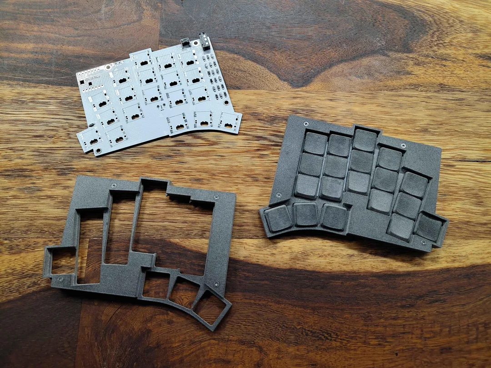
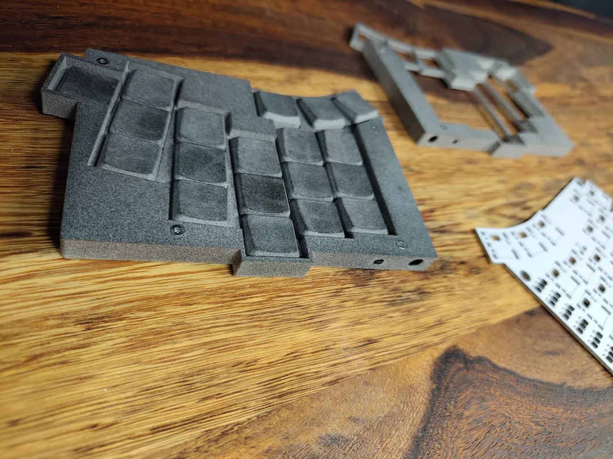
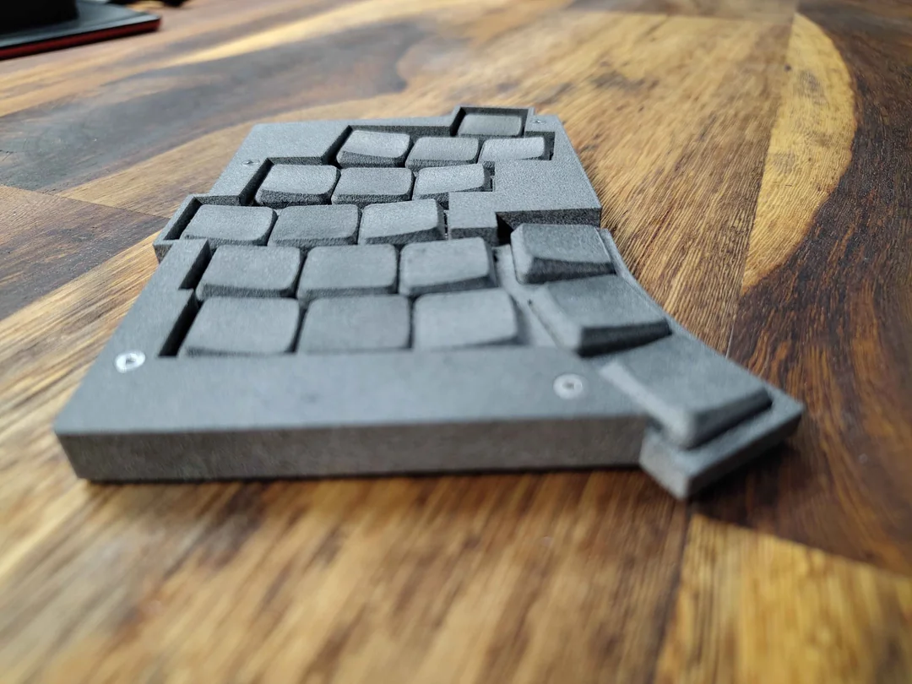

# Welcome!

This repository is to make the files of my Totem (by GeiGeiGeist) mod available for people to download.
This Project contains parts of and is inspired by:
- https://github.com/GEIGEIGEIST/TOTEM
- https://github.com/unspecworks/delta-omega

This mod was made to work with both Cherry MX ULP or Kailh PG1316s but was **only tested with the Cherry MX ULP's**
Currently the Case supports **only wired builds** but the PCB itself should also be capable of being used wireless (**UNTESTED!**)

## Modifications

I edited the original Totem PCB to instead use the Switch Footprints from the Delta Omega. Then I remade the traces of all the connections.

## Order Instructions

PCB, Case and Keycaps have been ordered from JLCPCB/JLC3DP.
The PCB can be ordered with the same settings as the original (https://github.com/GEIGEIGEIST/TOTEM/tree/main/PCB).
I had the case printed in PA12-HP Nylon with the default settings.

## Build "Guide"

Since this is pretty spontaneous, I forgot to take pictures during my initial build and I don't have any parts left over, so I'll try my best to give instructions in text form.
For more specific Instructions see https://github.com/unspecworks/delta-omega/blob/main/docs/BUILD_GUIDES.md#switches

Before starting to solder the switches, remove any leftover loose metal from the inside of the holes in the PCB. If left as is, there is a chance they will short out switches and prevent them from working properly and are a pain to fix.

1. Lay the PCB on a flat surface, with the 5 silver pads around each switch placement facing UP.
2. Insert the Switch's alignment pins into the PCB
3. Heat up one corner of the Switch and PCB together and solder the switch in place so it doesn't move during the rest of the soldering
4. Solder the other 3 corners of the Switch
5. After Soldering every Switch, turn the PCB upside down and  solder the 2 contacts on the underside of each switch to the half-circle cutout in the Hole. Make sure the 2 pads of the switch are not bridged together!
6. Repeat for the other half.

## REQUIRED PARTS

| Part name        | Count | Remarks | 
| :--------------  | :---: | :------ |
| PCB       			 | 01 |  |
| Seeed Studio XIAO| 02 | This The PCB is compatible with both the wireless and wired MCU, but the case currently only supports wired connection. So this is the one you need: [RP2040 version (wired)](https://www.seeedstudio.com/XIAO-RP2040-v1-0-p-5026.html) |
| ULP Switch			 | 38 | Cherry MX ULP or Kailh PG1316s |
| diodes 1N4148W   | 38 | These are surface mount diodes in SOD123 package |
| 1u ULP keycaps	 | 38 | I had mine 3D Printed in PA12-HP Nylon from this repository [repository](https://github.com/mikeholscher/zmk-config-mikefive/tree/main/files/custom-keycaps) But you can also try to find commercial ones|
| reset button     | 02 | Alps SKHLLCA010 |
| USB-C cable      | 01 | For connecting the keyboard to your PC |
| TRRS jack        | 02 | MJ-4PP-9 or PJ320A (only required for the wired build)|
| TRRS cable       | 01 | 

Case Parts:
| Part name        | Count | Remarks | 
| :--------------  | :---: | :------ |
| M2x4mm Countersunk Head Screw | 08 | [Like this](https://de.aliexpress.com/item/32968097507.html) |
| M2x5mm Standoff      			 | 08 | [Like this](https://de.aliexpress.com/item/1005007386496068.html) |
| M2x4mm Flathead Screw     			 | 08 | [Like this](https://de.aliexpress.com/item/1005008305312481.html) |
| Rubber Feet   			 | 08 | Any rubber feet you find online should work |

## Images

